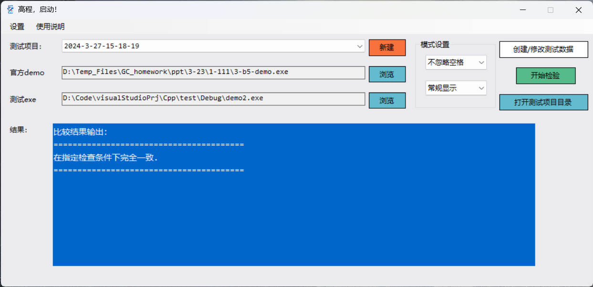
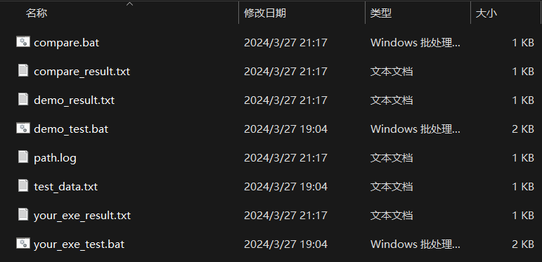

# 简介  
某大学简称为“高程”的课程使用  
完成设置后在本应用建立文件夹下一键生成：  
* 编号后的测试数据（test_data.txt）  
* demo测试批处理（demo_test.bat）  
* 用户程序测试批处理（your_exe_test.bat）  
* demo测试结果（demo_result.txt）  
* 用户程序测试结果（your_exe_result.txt）  
* 比对批处理（compare.bat）  
* 比对结果（compare_result.txt）  

## 界面预览  
<ul>
  <li>程序主界面预览 
    </li>
  <li>单次比对生成的所有文件预览 
    </li>
</ul>
<blockquote>（“你一定是坚坚的学生吧” 
<a href="https://www.zhihu.com/question/554569818/answer/2683685957?utm_psn=1756798166148907008" target="_blank">——YouKnowWho from zhihu</a>
</blockquote>  
