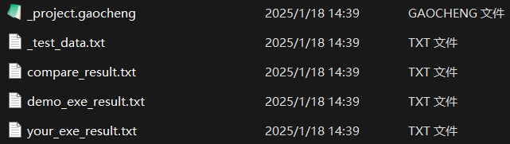

# 简介（适用于1.7.0及之后）
某大学简称为“高程”的课程使用  
完成测试后在本应用建立的目录下一键生成（字符串升序排列）:
* 项目信息记录文件（_project.gaocheng）
* 编号后的测试数据（_test_data.txt）
* 比对结果（compare_result.txt）
* 官方demo测试结果（demo_exe_result.txt）
* 作业exe测试结果（your_exe_result.txt）

### [点此下载](https://github.com/LUFTSCH1/gaocheng_debug/releases/latest)

## 界面预览
* 应用主界面预览

* 单次测试生成的所有文件预览

## 编译须知（如果你想编译源码的话）
首次编译后直接运行可能报错，需要将resource文件夹中的的rsc文件夹以及README.html文件复制到生成exe同级目录下。若还无法正常运行，则检查MutSync.cs文件代码中检查的文件存在性、检查的文件大小是否超过2MB，以及MD5是否正确（尤其是gaocheng_debug.exe.config）

<blockquote>（“你一定是坚坚的学生吧” 
<a href="https://www.zhihu.com/question/554569818/answer/2683685957" target="_blank">——YouKnowWho from 某蓝色高端论坛</a>
</blockquote>