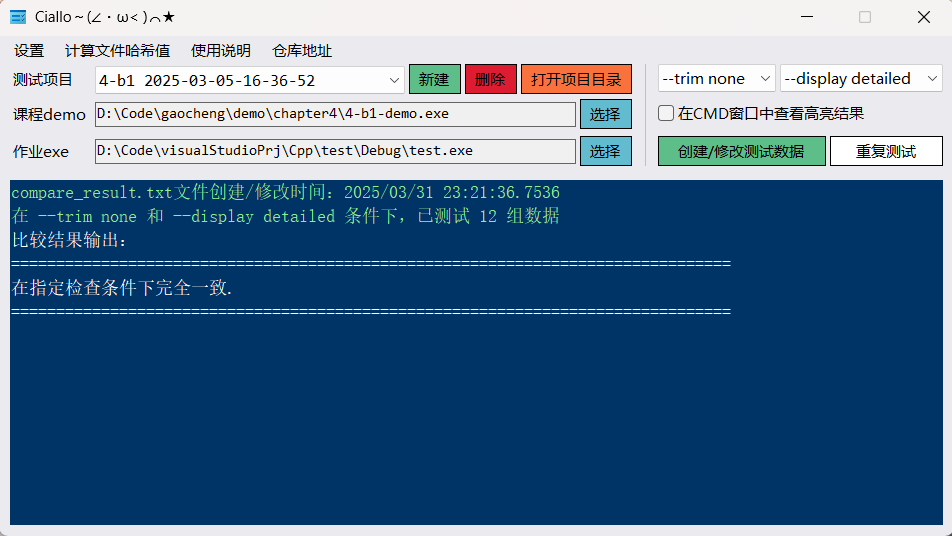

# 简介  
某大学简称为“高程”的课程使用  
完成设置后在本应用建立的目录下一键生成（字符串升序排列）：  
* 路径及设置参数记录文件（__path.log）  
* 编号后的测试数据（__test_data.txt）  
* 比对结果（_compare_result.txt）  
* demo测试结果（_demo_result.txt）  
* 用户程序测试结果（_your_exe_result.txt）  
* 校对批处理（compare.bat）  
* demo测试批处理（demo_test.bat）  
* 用户程序测试批处理（your_exe_test.bat）  

## 界面预览  
<ul>
  <li>程序主界面预览 
    </li>
  <li>完成一次校对生成的所有文件预览 
    </li>
</ul>
<blockquote>（“你一定是坚坚的学生吧” 
<a href="https://www.zhihu.com/question/554569818/answer/2683685957" target="_blank">——YouKnowWho from zhihu</a>
</blockquote>  
